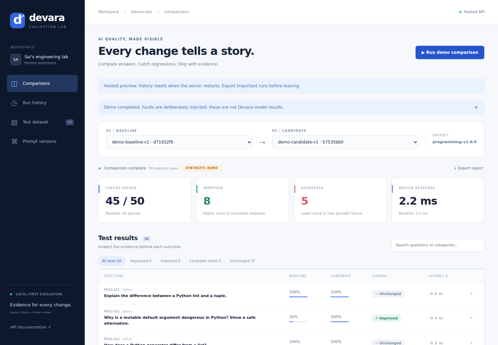

# Devara Eval

**Publish online:** Follow [HOSTING.md](HOSTING.md) to upload to GitHub and deploy the complete app on Render. The included free-preview configuration requires a login and uses temporary history.

A local AI response evaluation and regression testing platform, built for Sai Nikhith Atmakuri's Devara programming assistant.

**Status:** runnable v1.1 with a FastAPI backend, SQLite persistence, React dashboard, 50-question dataset, deterministic evaluation, human reviews, CLI exports, automated tests, and Ollama/Devara HTTP adapters. The included results come from synthetic reference fixtures and deliberately injected faults. The actual Devara source/runtime was not available during development, so live Devara integration still needs your endpoint or Python function.



## Start on your Mac

You need **Python 3.11 or newer**. The download includes the compiled dashboard, so Node.js is only needed when editing its source. Initial Python dependency installation requires internet access.

1. Unzip `devara-eval.zip` and open Terminal in the extracted `devara-eval` folder.
2. Run:

```bash
bash scripts/start.sh
```

3. Open **http://127.0.0.1:8000**.
4. Click **Run demo comparison**. No API key or model download is needed.
5. Select **Regressed**, open a case, inspect both answers and failed checks, and save a human review.
6. Use **Export report** to download a comparison JSON. Run history also exports individual runs, including review history.

The server stays in your Terminal. Press Control+C to stop it. Your runs stay in `storage/eval.sqlite3`. Keep one server worker running; this v1 has an in-process queue.

If you use the source without compiled assets, first run `cd frontend && npm ci && npm run build`, then return to the repository root.

## What is implemented

- Versioned 50-question dataset spanning Python, Java, JavaScript, SQL, algorithms, APIs, testing, security, and systems.
- Explicit expected-concept aliases, minimum response length, and requested code-block checks.
- Immutable prompt/model versions; complete dataset and configuration snapshots per run, with SHA-256 hashes.
- Sequential asynchronous evaluation with per-question deadlines, bounded queue, response-size limit, and restart recovery.
- Typed failure outcomes: timeout, malformed response, empty answer, and provider error. Individual provider failures do not stop the remaining cases.
- Comparisons reject incompatible datasets/scorers and incomplete runs. They show improvements, regressions, unchanged cases, and all candidate failures.
- Per-response timings; median and nearest-rank P95 summaries, including failure wait time.
- Append-only human review records with reviewer, timestamp, scores, and rationale.
- JSON/Markdown evidence exports and a CLI regression exit code for CI.
- Local HTTP adapter contracts for Ollama and Devara, tested with controlled transports.

## What the demo proves

The demo deliberately improves eight weak answers and introduces five regressions. The expected fixture result is **8 improved, 5 regressed, 37 unchanged**. A candidate may pass more cases overall while introducing specific regressions worth catching.

Those counts demonstrate the evaluation platform's behavior against constructed fixtures. They are **not model accuracy, benchmark superiority, or measured Devara performance**. Latency values in `evidence/` were actually observed while running the fixtures, including an injected timeout. No human judgments were fabricated.

## Run tests and reproduce evidence

```bash
# From the repository root, after startup has installed the environment:
source .venv/bin/activate
python -m pytest -q
python -m app.cli demo --out evidence/reproduced
```

CLI-only setup, without Node or the dashboard:

```bash
python3 -m venv .venv
source .venv/bin/activate
python -m pip install -r requirements.lock
python -m app.cli demo --out evidence/reproduced
```

Use the CLI while the API server is stopped, or give the CLI its own `--db` path. The CLI and server do not share the in-process run queue.

```bash
python -m app.cli run --version ollama-baseline-v1 --timeout 60
python -m app.cli run --version ollama-candidate-v1 --timeout 60
# Replace these with the IDs printed by the two commands:
python -m app.cli compare --baseline BASELINE_RUN_ID --candidate CANDIDATE_RUN_ID --out evidence/live --fail-on-regression
```

Comparison exits 1 when regressions are found with `--fail-on-regression`; successful comparisons otherwise exit 0. Invalid arguments or incompatible comparisons exit 2.

## Connect an actual model

### Ollama

Install Ollama separately and pull a model that fits your machine. The bundled versions name `qwen2.5-coder:7b`; downloading that model requires disk space, RAM, and internet access.

```bash
ollama pull qwen2.5-coder:7b
# Start the Ollama service if it is not already running:
ollama serve
```

The evaluator calls `http://127.0.0.1:11434/api/chat` by default. In **Run history**, select `ollama-baseline-v1` or `ollama-candidate-v1` and use an appropriate timeout, such as 60–120 seconds. A cold model can be slow. Set `OLLAMA_URL` before starting the evaluator if your server uses another address. The value is the full `/api/chat` endpoint.

### Devara

See [docs/DEVARA_INTEGRATION.md](docs/DEVARA_INTEGRATION.md) for the JSON contract and a Python bridge. Set `DEVARA_URL` to your endpoint before starting the evaluator. API keys stay in server environment variables. They are not accepted from the dashboard or stored with runs.

**Integration limitation:** the adapter is contract-tested, but your actual Devara implementation has not been connected or evaluated. If it ignores the supplied prompt or shares chat memory across questions, results will not represent the intended experiment. Fix those integration behaviors before collecting portfolio evidence.

## Change prompts and datasets

Use **Prompt versions** to create a new immutable version. Set its provider, model/deployment revision, system prompt, and temperature. The dashboard uses seed 42; the API also accepts a configurable seed. Existing IDs cannot be overwritten. Demo behavior is controlled by fixture variants and does not respond to natural-language prompt edits.

For dataset changes, edit `data/programming-v1.json`, increment the dataset version, and restart the server. Each run stores its own dataset snapshot. Compare two new runs on the same dataset; comparisons to old hashes are rejected. Reference answers in `data/demo_answers.json` are for fixture demonstrations only and are never sent to real providers. If adding or renaming cases, also maintain demo fixtures or use a real provider.

The platform never executes model-generated code. A fenced-code check confirms structure, not runnable or safe code. The [review rubric](docs/HUMAN_REVIEW.md) addresses semantic correctness and includes calibration guidance.

## Develop the dashboard

Use Node.js 20.19+ or 22+ and two terminals:

```bash
# Terminal 1, repository root:
source .venv/bin/activate
uvicorn app.main:create_app --factory --host 127.0.0.1 --port 8000
```

```bash
# Terminal 2:
cd frontend
npm ci
npm run dev
```

Open http://127.0.0.1:5173. Vite proxies `/api` to FastAPI. After edits, `npm run build` refreshes the dashboard served on port 8000. The npm lockfile and Python lock file capture the dependencies used for this delivery.

For optional browser smoke testing, see `scripts/browser-smoke.cjs`. Install Playwright (`npm install --no-save --package-lock=false playwright` in the repository root), run `npx playwright install chromium`, start a clean server, then run `node scripts/browser-smoke.cjs`. This starts demo runs and saves a test human review in that server's local database; use a disposable `EVAL_DB` when testing.

## Project map

| Path | Purpose |
|---|---|
| `app/main.py` | HTTP routes, queue, validation, local origin protection |
| `app/engine.py` | Run orchestration, snapshots, comparisons, metrics |
| `app/providers.py` | Demo, Ollama, and Devara adapters |
| `app/scoring.py` | Explainable lexical/format rules |
| `app/store.py` | SQLite schema and persistence |
| `app/cli.py` | Headless runs and report generation |
| `data/` | Versioned questions and isolated demo fixtures |
| `frontend/src/` | React dashboard source |
| `tests/` | API, provider contract, failure, and scoring tests |
| `examples/devara_bridge.py` | Optional wrapper for your own Devara function |
| `docs/` | Architecture, rubric, integration, and engineering notes |
| `evidence/` | Actual fixture execution output and test logs |

## Scope and limitations

This is a **single-user portfolio application** with local and hosted-preview modes, not a multi-user production service. Local mode uses the default loopback binding. Hosted mode now adds single-owner password authentication and trusted-host configuration; see HOSTING.md. Individual user accounts, multi-tenant authorization, a durable job queue, and database migrations are not implemented.

Runs are processed serially to reduce latency interference. A server restart marks unfinished work interrupted; partial results remain, but automatic resumption is not implemented. The history view shows the latest 100 runs. SQLite holds the complete records until you deliberately remove the local database.

The lexical scorer has false positives and false negatives, including negation and valid paraphrases; one test explicitly demonstrates this limitation. Repeated live measurements and human review are needed before making claims about quality. Model labels do not prove identical weights; record the actual model digest, Devara commit, hardware, and settings in your experiment notes.

## Technical references

- [FastAPI testing documentation](https://fastapi.tiangolo.com/tutorial/testing/)
- [Ollama chat API](https://docs.ollama.com/api/chat)

See [docs/PORTFOLIO_GUIDE.md](docs/PORTFOLIO_GUIDE.md) for an honest demonstration and publication checklist.
