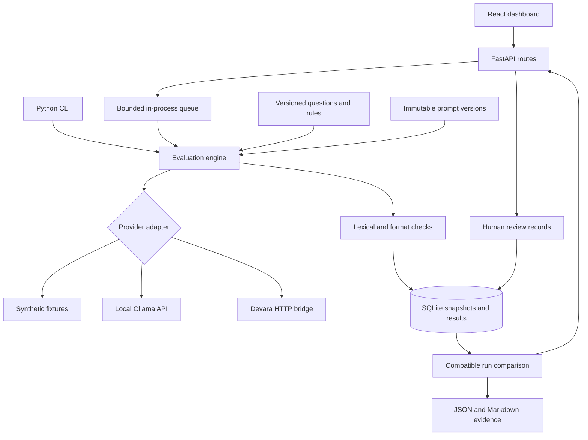
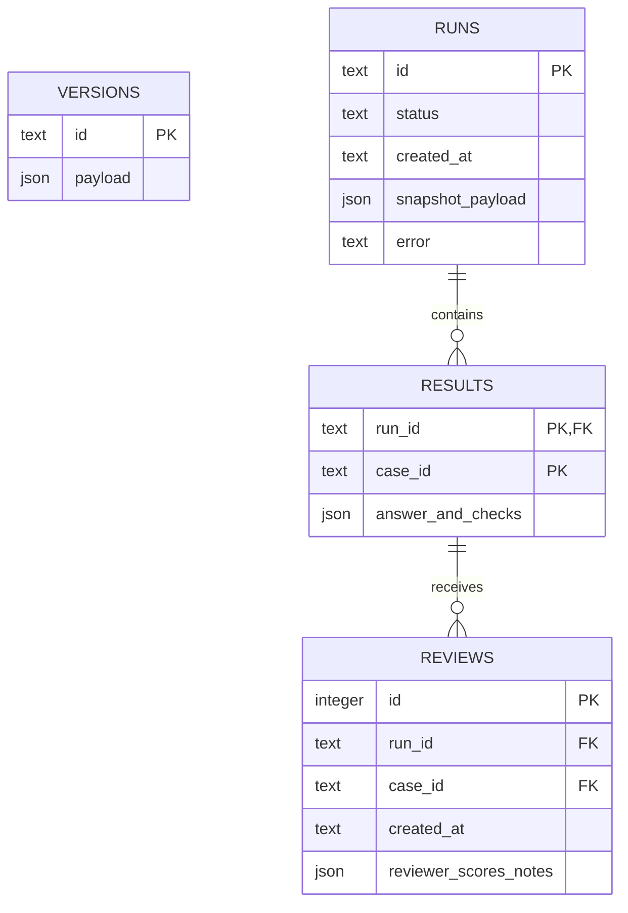

# Architecture and experiment flow

1. Validate a run request and resolve an immutable prompt/model version.
2. Snapshot the complete dataset, version settings, timeout, scorer version, and hashes.
3. Process runs one at a time. Send only the question and prompt/model settings to real providers, never reference answers or scoring aliases.
4. Enforce an end-to-end deadline around each adapter call, and limit HTTP response bodies to 1 MB.
5. Persist the raw answer, check outcomes, status, and monotonic elapsed milliseconds after every case. Continue after known provider failures; fail the whole run for unexpected internal errors.
6. Compare only completed runs with matching dataset and scorer hashes. Score decreases and newly introduced provider failures are regressions. Score increases and recovered responses are improvements. Other cases are unchanged. Candidate failure is an independent filter.
7. Record human reviews separately and append them to exports. Review scores do not silently change deterministic results.

## Data model

A run embeds a version snapshot instead of relying on a mutable relationship to prompt configuration. SQLite foreign keys enforce that reviews belong to persisted results. Review history is append-only. Connections close after each operation, and write-ahead logging reduces read/write contention.

## Why these choices

| Decision | Benefit | Limit |
|---|---|---|
| SQLite first | No database server to configure | Single-machine workflow; no migration framework yet |
| Sequential runs | Predictable model load and easy reasoning | Lower throughput |
| Literal alias checks | Explainable, cheap, offline | Cannot determine semantic truth |
| Separate human rubric | Explicit correctness judgment | Requires reviewer time and calibration |
| No generated-code execution | Simple isolation boundary | Code correctness is not automatically verified |
| Server-configured endpoints | Dashboard cannot choose arbitrary request targets | Endpoint changes require server configuration |
| Frozen snapshots and hashes | Historical results remain interpretable | Model label alone does not freeze model weights |
| In-process queue | Small local setup | No automatic restart/resume or multiple workers |

## Next engineering milestones

Connect actual Devara, record its repository revision, and run a baseline experiment. Next add a separate held-out question set, review calibration, repeated paired measurements, and only then consider PostgreSQL, a durable worker queue, and authenticated hosting.
